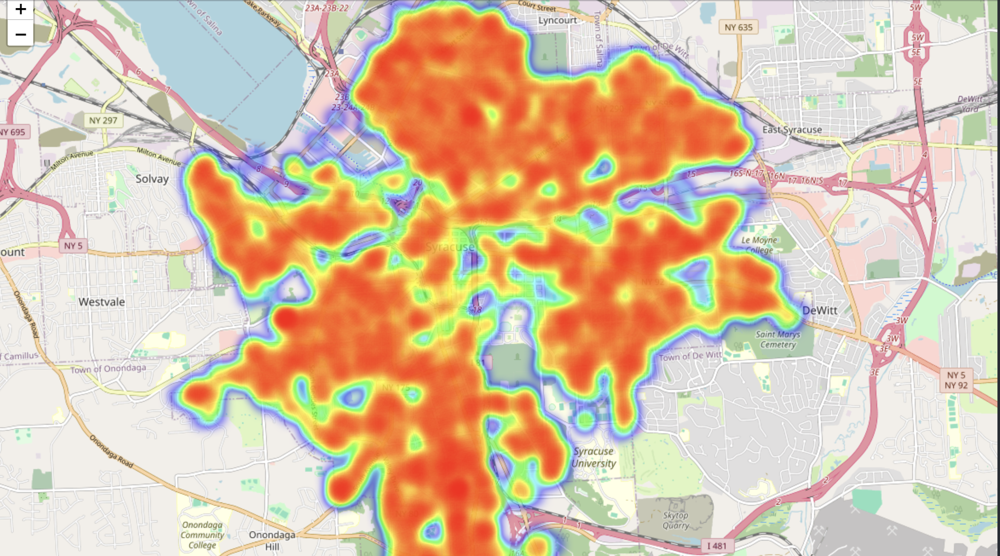
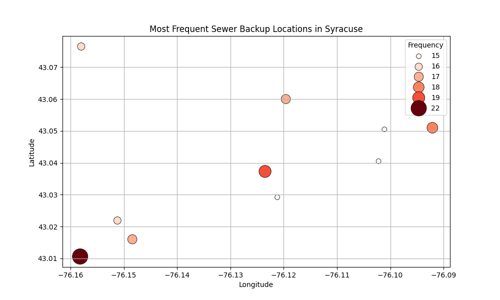
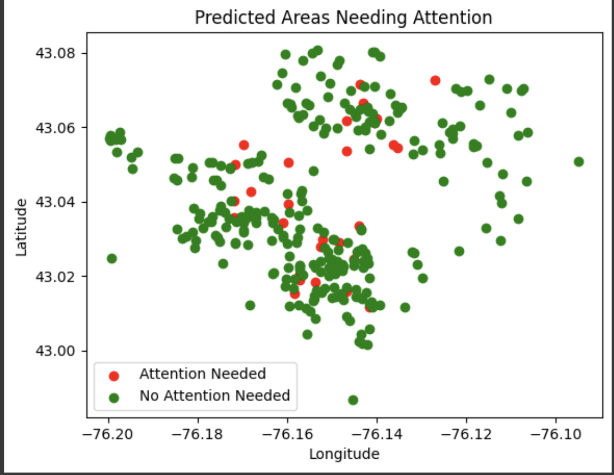

# City Services Analysis and Prediction Model

## Project Overview
This project analyzes city service data and develops machine learning models to predict service types and response times. It combines parcel data, parking information, and city service line data to create a comprehensive understanding of urban service patterns and needs.

## Key Features
- Multi-task neural network for predicting service types and response times
- Geospatial analysis of service distributions
- Sewer backup hotspot identification
- Interactive visualization of predictions
- Service time prediction model

## Data Sources
The project utilizes three main datasets:
- `parcel.csv`: Property parcel information including condition ratings
- `parking.csv`: Parking-related data
- `cityline.csv`: City service request records

## Key Findings

### Sewer Backup Analysis
- Generated heatmap visualization showing concentration of incidents
- Identified seasonal patterns in service requests
- Top 10 locations account for approximately 30% of all backup reports



### Service Response Time Patterns
- Average response times vary significantly by service type
- Geographic location influences service delivery speed
- Seasonal variations in service request volumes and response times

## Technical Architecture

### Data Processing Pipeline
```python
def merge_and_preprocess_data(df1, df3):
    # Clean coordinates
    df1 = df1.dropna(subset=['Lat', 'Lng'])
    df3 = df3.dropna(subset=['Lat', 'Lng'])

    # Build KDTree for spatial joining
    tree = cKDTree(df1[['Lat', 'Lng']].values)
    distances, indices = tree.query(df3[['Lat', 'Lng']].values, k=1)

    # Merge datasets
    df_combined = df3.join(df1.iloc[indices], rsuffix='_df1')
```

### Model Architecture
```python
class MultiTaskServiceTimeModel(nn.Module):
    def __init__(self, input_dim, num_service_classes, num_time_classes=3):
        super().__init__()
        self.shared_layer1 = nn.Linear(input_dim, 64)
        self.shared_layer2 = nn.Linear(64, 32)
        self.service_layer = nn.Linear(32, num_service_classes)
        self.time_layer = nn.Linear(32, num_time_classes)
```

## Visualizations

### Sewer Backup Heatmap
The heatmap visualization below highlights sewer backup hotspots, helping to identify areas with high incident concentrations.


### Most Frequent Backup Locations
The following visualization shows the most frequently reported locations for sewer backups, aiding in prioritizing infrastructure improvements.



### Model Predictions on Areas Needing Attention
The visualization below highlights the areas predicted to need the most attention, based on the model's analysis.



### Illegal Parking Heatmap
The heatmap below visualizes areas with high reports of illegal parking incidents, using Folium for an interactive experience. Most frequent violations locally near our campus occur on Marshall St.


